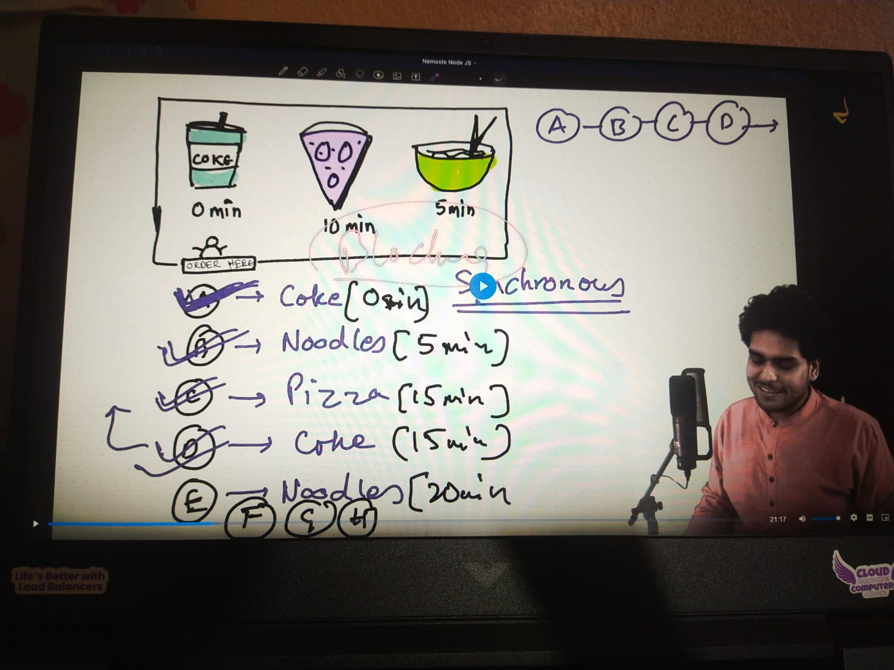
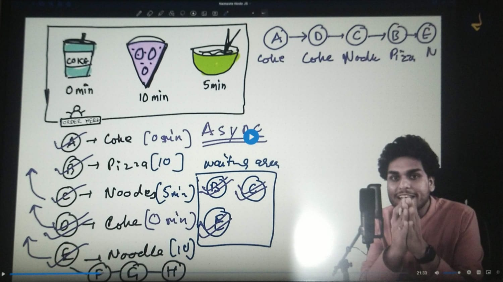
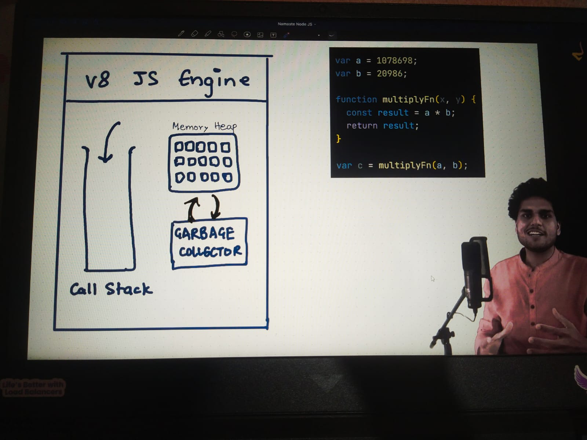

# 🎬 Episode 06 — libuv & I/O

> **Focus:** Understanding synchronous vs asynchronous programming and how JavaScript executes synchronous code.

---

## 🚀 Starting Point

Node.js has:

> **An event-driven architecture capable of asynchronous I/O.**

To understand this statement, I first explored the difference between **synchronous** and **asynchronous** programming.

---

## ⚡ Synchronous vs Asynchronous

| Synchronous                                           | Asynchronous                                                                 |
| ----------------------------------------------------- | ---------------------------------------------------------------------------- |
| Tasks execute one after another                       | Tasks can be started without waiting for them to finish                      |
| The next task waits for the current task              | Other work can continue while waiting                                        |
| Blocking behavior can occur                           | Non-blocking behavior is possible                                            |
| Like waiting for one customer before serving the next | Like taking another customer's order while the first order is being prepared |

### 🖼️ Synchronous



### 🖼️ Asynchronous



> **Restaurant analogy:** In synchronous work, you wait for one task to finish before moving to the next. In asynchronous work, a task can be started and you can continue doing other work while waiting.

---

## 🟨 JavaScript Is Synchronous

One important thing I learned:

> **JavaScript itself executes code synchronously by default.**

For example:

```js
console.log("First");

console.log("Second");

console.log("Third");
```

Execution:

```text
First
  ↓
Second
  ↓
Third
```

JavaScript executes these statements **one after another**.

---

## ⚙️ How Synchronous JavaScript Executes

JavaScript code is executed by the **V8 engine** in Node.js.

A simplified view of the important parts I learned:

```text
        JavaScript Code
               ↓
          V8 Engine
               │
       ┌───────┴────────┐
       ↓                ↓
   Call Stack      Garbage Collector
       │
       ↓
 Executes JavaScript
```

### 🖼️ V8 — Synchronous Execution



### 🔹 Call Stack

The **Call Stack** keeps track of the functions currently being executed.

For example:

```js
function greet() {
    console.log("Hello");
}

greet();
```

The function is placed on the call stack when it is called and removed after execution finishes.

---

## 🤔 The Important Question

If JavaScript executes synchronously, then:

> **How can Node.js perform asynchronous operations?**

This is the question that leads into the next part of the episode:

**libuv → I/O → Event Loop → Asynchronous execution**

---
