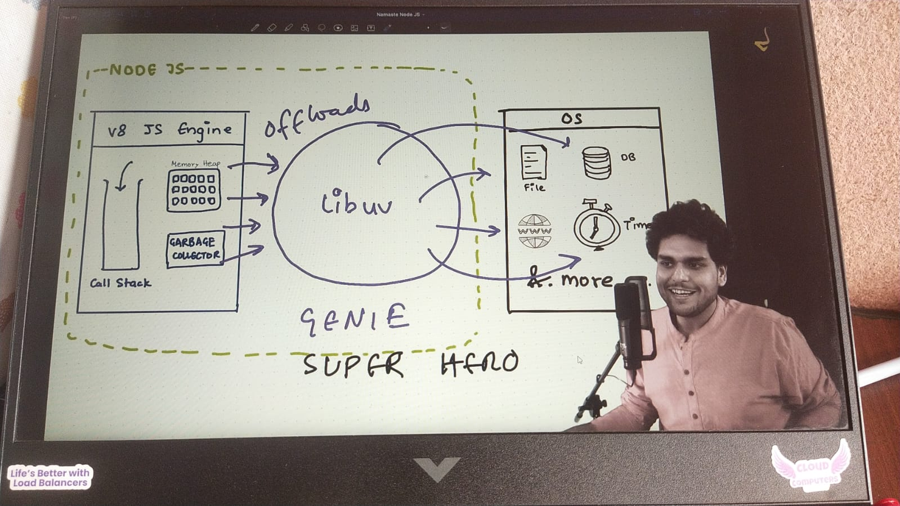
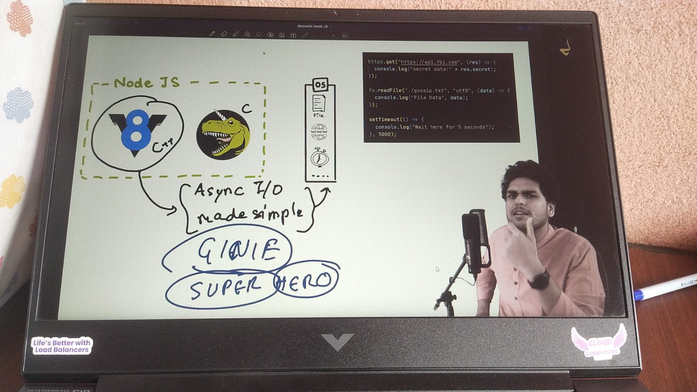
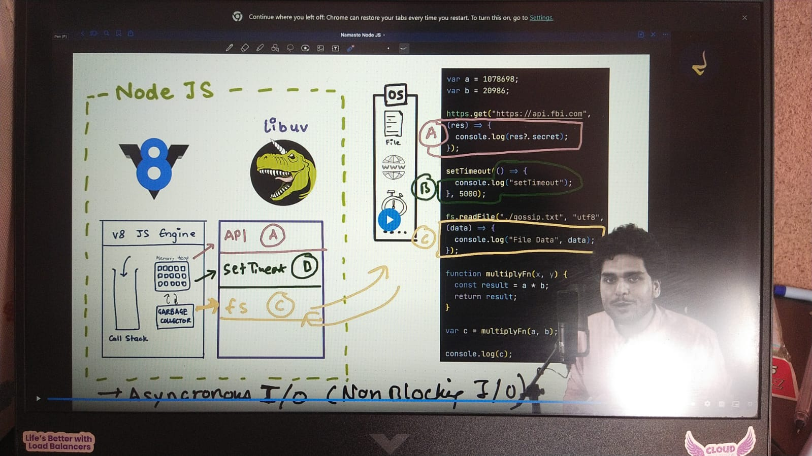

# 🎬 Episode 06 — libuv & I/O

> **Starting Point:** Node.js has an **event-driven architecture capable of asynchronous I/O.**

---

## 🔄 Synchronous vs Asynchronous

| Synchronous                          | Asynchronous                                                     |
| ------------------------------------ | ---------------------------------------------------------------- |
| Executes tasks one after another     | Allows tasks to be handled without blocking JavaScript execution |
| Next task waits for the current task | JavaScript can continue while async work is being handled        |
| Blocking                             | Non-blocking                                                     |
| Example: normal JavaScript execution | Example: file I/O, API requests, timers                          |

### 🖼️ Synchronous Programming


### 🖼️ Asynchronous Programming


---

## 🟨 How Synchronous JavaScript Executes

JavaScript execution is **synchronous by default**.

The **V8 JavaScript engine** executes JavaScript code.

```js
console.log("First");
console.log("Second");
console.log("Third");
```

Execution:

```text
First
  ↓
Second
  ↓
Third
```

### V8 Engine

```text
JavaScript Code
      ↓
  V8 Engine
      │
  ┌───┴────────────┐
  ↓                ↓
Call Stack    Garbage Collector
  │
  ↓
Executes JavaScript
```

### 🖼️ V8 Synchronous Execution


---

# ⚡ Why Does JavaScript Need Node.js?

V8 executes JavaScript, but JavaScript applications also need to perform operations such as:

* 📁 File I/O
* 🗄️ Database operations
* 🌐 API / Network requests
* ⏱️ Timers

**V8 alone does not provide all of these runtime capabilities.**

This is where **Node.js** comes in.

---

# 🚀 Node.js + V8 + libuv

Node.js provides a runtime environment around V8.

One important part of this runtime is **libuv**.

## 🧠 What is libuv?

**libuv is a cross-platform library used by Node.js for asynchronous I/O and event-loop infrastructure.**

It helps Node.js communicate with the **Operating System (OS)** and handle asynchronous operations.

> 💡 **Mental model:**
> V8 executes JavaScript → Node.js provides runtime capabilities → libuv helps with asynchronous I/O and event-loop handling.

---

# 🔗 Node.js, V8, libuv & OS

```text
              Node.js
        ┌─────────────────┐
        │                 │
        │   V8 Engine     │
        │  JS Execution   │
        │                 │
        │       ↕         │
        │      libuv      │
        │                 │
        └────────┬────────┘
                 ↕
        Operating System
```

### 🖼️ Node.js + V8 + libuv + OS



---

# 🔄 How Asynchronous Tasks Are Handled

When JavaScript encounters an asynchronous operation, Node.js can hand the work off to the runtime's asynchronous mechanisms instead of making the JavaScript execution wait for the operation to finish.

```text
JavaScript Code
      ↓
   V8 Engine
      ↓
Async Operation
      ↓
    libuv
      ↓
Operating System
      ↓
    Result
      ↓
    libuv
      ↓
 V8 / JavaScript
```

### 🖼️ Asynchronous Task Workflow



---

# 🧩 Sync + Async Tasks in Node.js

Node.js can handle both **synchronous JavaScript execution** and **asynchronous operations**.

Example:

```js
var a = 1078698;
var b = 20986;

https.get("https://api.example.com", (res) => {
    console.log(res);
});

setTimeout(() => {
    console.log("setTimeout");
}, 5000);

fs.readFile("./gossip.txt", "utf8", (data) => {
    console.log("File Data", data);
});

function multiplyFn(x, y) {
    const result = x * y;
    return result;
}

var c = multiplyFn(a, b);

console.log(c);
```

### 🧠 What happens conceptually?

```text
                 Node.js
                    │
          ┌─────────┴─────────┐
          ↓                   ↓
       V8 Engine            libuv
          │                   │
    Sync JavaScript      Async Operations
          │                   │
          │              ┌────┴────┐
          │              ↓         ↓
          │             OS      Async APIs
          │              │
          │              ↓
          └─────── Result / Callback
```

### 🖼️ Sync + Async Node.js Flow



---

# 📌 What I Learned About libuv

* **V8** executes JavaScript.
* JavaScript execution is **synchronous by default**.
* V8 alone cannot provide things like file I/O, network operations, and timers.
* **Node.js** provides the runtime environment around V8.
* **libuv** is a key part of Node.js for asynchronous I/O and event-loop infrastructure.
* libuv works with the **Operating System** to handle asynchronous operations.
* Node.js can handle **synchronous JavaScript and asynchronous operations** together.
* The result of asynchronous work is eventually brought back into the JavaScript execution flow.

---

## 🧠 Episode 06 Mental Model

```text
                 Node.js
                    │
          ┌─────────┴─────────┐
          ↓                   ↓
         V8                 libuv
          │                   │
   Execute JavaScript    Async I/O
          │                   │
          │                   ↓
          │                  OS
          │                   │
          │                   ↓
          └────────────── Result
                    ↓
               JavaScript
```

> **V8 executes JavaScript. Node.js provides the runtime environment, while libuv provides important asynchronous I/O and event-loop infrastructure that allows Node.js to handle non-blocking operations.**

---

# 🎯 Episode 06 Complete

**Learned:** Synchronous vs asynchronous execution → V8 → Node.js runtime → libuv → OS → asynchronous I/O → how Node.js handles sync + async work together.

➡️ **Next Episode:** Dive deeper into **libuv, I/O, and the Event Loop**.
