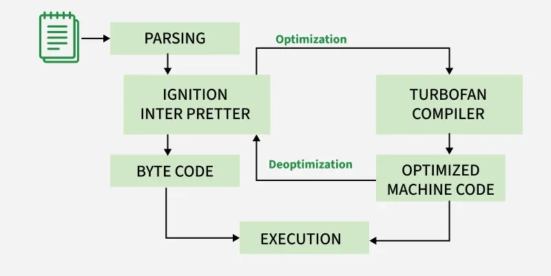

# 🚀 Episode-08 | Deep Dive into V8 JavaScript Engine

> **What happens inside V8 after we give it JavaScript source code?**
>
> Modern V8 uses **both interpretation and JIT compilation** to execute JavaScript efficiently.

## 🧠 1. Big Picture

JavaScript is **not purely an interpreted language** and not purely a compiled language in modern engines like V8.

V8 uses **JIT (Just-In-Time) Compilation**, where code can start executing through the **Ignition interpreter** and frequently executed code can later be optimized by the **TurboFan compiler**.

---

## ⚙️ 2. V8 Execution Pipeline

```text
JavaScript Source Code
        ↓
     Parsing
        ↓
  Ignition Interpreter
        ↓
     Bytecode
        ↓
    Execution
        ↓
   Hot Code Found
        ↓
  TurboFan Compiler
        ↓
Optimized Machine Code
        ↓
    Faster Execution
````

### 🔹 Step 1 — Parsing

V8 first parses the JavaScript source code.

```text
Source Code
    ↓
Tokenization
    ↓
Syntax Analysis
    ↓
AST (Abstract Syntax Tree)
```

* **Tokenization:** Source code is divided into tokens.
* **Parsing:** Tokens are checked according to JavaScript grammar.
* V8 builds an **AST (Abstract Syntax Tree)** representing the structure of the code.

---

### 🔹 Step 2 — Ignition Interpreter

The AST is used by **Ignition**, V8's interpreter, to generate **bytecode**.

```text
AST
 ↓
Ignition
 ↓
Bytecode
```

The bytecode is then executed.

> 💡 **Why bytecode?**
>
> It is a compact intermediate representation that can be executed efficiently and also provides information useful for later optimization.

---

## 🔥 3. When Does TurboFan Come In?

While the program is running, V8 observes how the code behaves.

If some function/code runs **many times**, it becomes **hot code**.

```text
Ignition
   ↓
Execute Bytecode
   ↓
Frequently executed?
   ↓ YES
TurboFan
   ↓
Optimize
   ↓
Machine Code
```

**TurboFan** compiles hot code into optimized machine code so that it can execute faster.

This is the **JIT (Just-In-Time) compilation** idea.

---

## 🔄 4. Deoptimization

Optimization is based partly on assumptions about how code is being used.

For example:

```js
function sum(a, b) {
    return a + b;
}

sum(10, 20);
sum(30, 40);
sum(50, 60);
```

V8 may observe that `sum()` is repeatedly receiving numbers and optimize the code based on that behavior.

Later:

```js
sum("Hello ", "World");
```

The previous assumptions may no longer be valid.

So V8 can:

```text
Optimized Machine Code
        ↓
Assumption becomes invalid
        ↓
   Deoptimization
        ↓
   Ignition / Bytecode
        ↓
Continue Execution
```

> 🔑 **Deoptimization = V8 throws away an invalid optimization and falls back to a safer execution path.**

---

## 🧩 5. Important V8 Optimization Concepts

### ⚡ Inline Caching (IC)

V8 remembers information about how an operation is usually used.

For example, if the same type of object/property is accessed repeatedly, V8 can make future property access faster.

**Idea:**

```text
Repeated operation
       ↓
Remember previous type/structure
       ↓
Faster future access
```

---

### 📦 Copy Elision

Copy elision is an optimization where unnecessary copying of data can be avoided.

```text
Unnecessary copy
      ↓
Avoid the copy
      ↓
Less work + better performance
```

---

## 🗑️ 6. Garbage Collection

While JavaScript executes, objects that are no longer reachable become **garbage**.

V8's garbage collector identifies and removes these objects to free memory.

Some important names/concepts I learned:

* **Orinoco** → V8's garbage-collection project/architecture
* **Scavenger** → focuses on young-generation garbage collection
* **Mark-Compact** → marks reachable objects and compacts memory
* **Oilpan** → garbage collector associated mainly with Blink/DOM memory management

```text
Unused Objects
      ↓
Garbage Collector
      ↓
Memory Reclaimed
```

---

## 🏗️ 7. Crankshaft → TurboFan

V8 previously had an optimizing compiler called **Crankshaft**.

```text
Old V8:
Ignition + Crankshaft
```

Modern V8 uses **TurboFan** as its optimizing compiler.

```text
Modern V8:
Ignition + TurboFan
```

So:

> **Crankshaft = older optimizing compiler**
>
> **TurboFan = modern optimizing compiler**

---

## 🔁 Complete Concept

```text
JavaScript Source
        ↓
     Parsing
        ↓
      AST
        ↓
    Ignition
        ↓
     Bytecode
        ↓
    Execution
        ↓
   Hot Code?
    ↙      ↘
  No        Yes
  ↓          ↓
Continue   TurboFan
           ↓
      Optimization
           ↓
   Optimized Machine Code
           ↓
       Fast Execution
           ↓
 Assumption Invalid?
           ↓
     Deoptimization
           ↓
       Back to safer
       execution path
```

Meanwhile:

```text
        🗑️ Garbage Collector
                 ↓
       Manages unused memory
```

---

## 🎯 Key Takeaways

* **V8 is not simply an interpreter.**
* Modern V8 uses **JIT compilation**.
* **Parsing → AST → Ignition → Bytecode → Execution**
* Frequently executed **hot code** can be optimized by **TurboFan**.
* Optimized code can later be **deoptimized** when assumptions become invalid.
* **Inline caching** helps speed up repeated operations.
* **Garbage collection** automatically manages unused memory.
* **Crankshaft** was an older optimizing compiler; **TurboFan** is the modern one.

### 🖼️ V8 Architecture Diagram




> **Core idea to remember:**
> **Ignition gives V8 fast startup and execution through bytecode, while TurboFan makes frequently executed code faster through optimization.**

```
```
